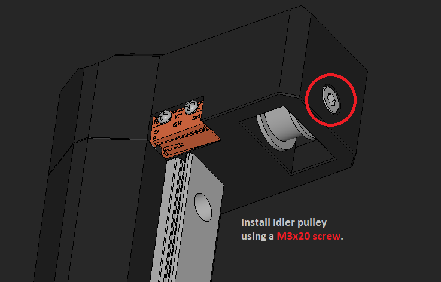

# The Build 

### Electrical Preperations
* Trim stepper motor cable to be 90mm long and crimp to suit EBB42 Motor connector.
* Trim solenoid cable to be 190mm long.
* Crimp 150mm long switch NO and COM wires to suit EBB42 Endstop connector (PB6, GND) and crimp the other end to suit switch.
* Crimp 150mm long switch LED wires to suit EBB42 FAN1 connector (VIN, PA0) and crimp the other end to suit switch.
* Crimp 1060mm long sensor wires to suit EBB42 TH0 connector (GND, PA3) (Optional but recommended to add a connector at the filler mount end).
* Crimp 1080mm long servo wires to suit EBB42 Probe Connector (GND, +5V, PB9) and solder 2.54 header on the other end (Optional but recommended to add a connector at the filler mount end).
* Crimp 660mm long endstop wires to suit EBB42 Probe Connector (GND, PB8).
* Crimp 150mm long power wires to suit EBB42 CAN connector (GND, VIN) and crimp other end to suit DC jack.
* Apply the EBB42 stepper motor heatsink and install the VBUS jumper.

### Tube Preperations
* Cut a piece of 8mm OD tube 770mm long for the beer line.
* Cut a piece of 8mm OD tube 815mm long for the gas line.

### 3D Print Preperations
* Install 4 off M3 threaded inserts into base.stl.
* Install 4 off M3 threaded inserts into motor_mount.stl.

### Dip Tube Preperations
* Cut down a keg dip tube to 70mm long. Preferably 1 without the liquid centering notches or you will need to also notch out the liquid bulkhead fitting as I did.

 

 
 
 
 
 
 
 
 
 
 
 
 
 
 
 
 
 
 
 
 
 
 
 
 
 
 
 
